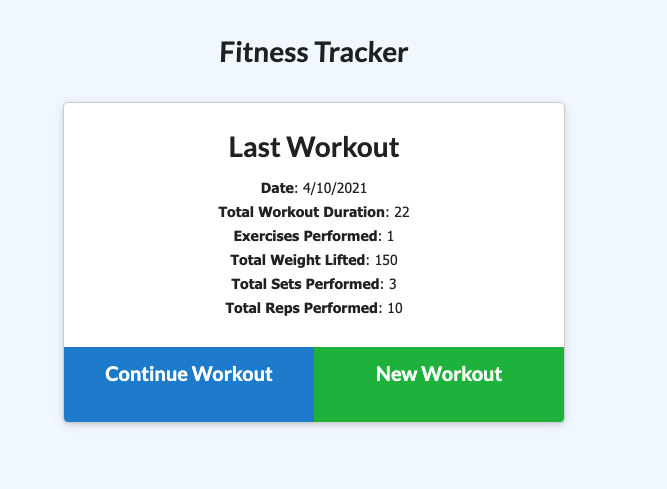

# Fitness Tracker 

  ## Table of Contents

  * [Usage](#Usage)
  * [Dependencies](#Dependencies)
  * [License](#License)
  * [Questions](#Questions)

## Usage
Fitiness Tracker is designed to track your workout based on resistance and cardio. It summarizes the name, type, weightm sets, reps, and duration of exercise. For cardio your able to track your distance. 
The summary also gives you a graph summery 

## Dependencies
- Express
- Mongoose
- Morgan

## License 
This project is licensed under : [MIT](https://opensource.org/licenses/MIT)

### Questions?
You can visit: [GitHub](https://github.com/ginavargas1)  
For any additional questions you can contact me at <gina.vargas89@outlook.com>
  
[Back to Top](#table-of-contents)